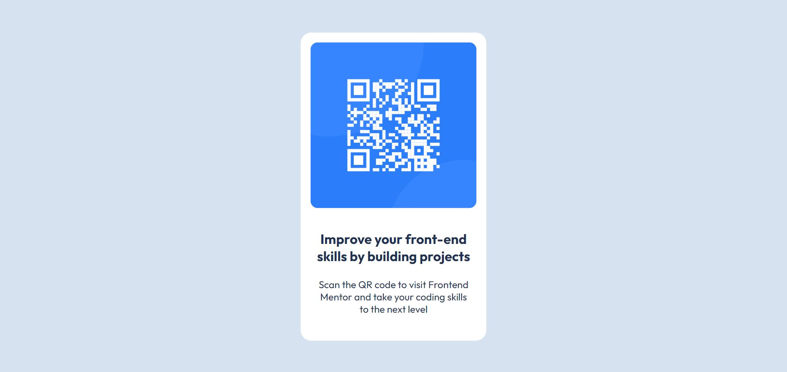

# Frontend Mentor - QR code component solution

This is a solution to the [QR code component challenge on Frontend Mentor](https://www.frontendmentor.io/challenges/qr-code-component-iux_sIO_H). Frontend Mentor challenges help you improve your coding skills by building realistic projects. 

## Table of contents

- [Overview](#overview)
  - [Screenshot](#screenshot)
  - [Links](#links)
- [My process](#my-process)
  - [Built with](#built-with)
  - [What I learned](#what-i-learned)
  - [Continued development](#continued-development)
  - [Useful resources](#useful-resources)
- [Author](#author)

## Overview

### Screenshot



### Links

- Solution URL: [Live Solution](https://fm-01-qr-code-component-acu6.vercel.app/)

## My process

### Built with

- Semantic HTML markup
- CSS custom properties

### What I learned

I learned how to use position: (relative, absolute, fixed and sticky) in CSS and how works: 

```css
transform: translate(-50%, -50%)
```

### Continued development

In the next projects I want to use flex and understand better how it works

### Useful resources

- [CSS classes](https://medium.com/insider-inc-engineering/delightful-ways-to-write-reusable-css-using-subclasses-903e90c9cf87) - This helped me to undertand how to write resuable css classes.

## Author

- Frontend Mentor - [@dunaidan](https://www.frontendmentor.io/profile/dunaidan)
